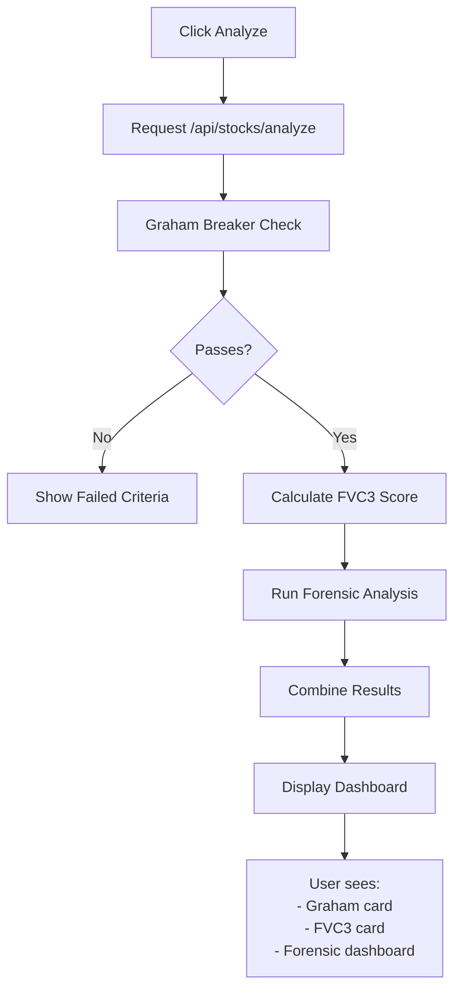

# 📚 Documentation Index

## Quick Navigation

### 🚀 Getting Started (Start Here!)
**→ [QUICKSTART.md](./QUICKSTART.md)**
- 5-minute setup guide
- How to run the app
- Sample stocks to analyze
- Common code examples
- Troubleshooting

---

### 🏗️ Architecture & Implementation
**→ [POLYTOPE_MODEL.md](./POLYTOPE_MODEL.md)**
- Complete system overview
- 3-layer framework (Graham → FVC3 → Forensic)
- API endpoint documentation
- Database schema
- React component structure
- How to extend/customize

---

### 🧮 Mathematical Foundations
**→ [MATHEMATICS.md](./MATHEMATICS.md)**
- Graham Circuit Breaker formulas
- FVC 3.0 scoring equations
- Forensic alarm detection logic
- Statistical properties
- Backtesting framework

---

### ✅ What's Been Built
**→ [IMPLEMENTATION.md](./IMPLEMENTATION.md)**
- Complete list of finished components
- File locations and line counts
- Technology stack
- Data flow diagrams
- Next steps for deployment

---

## 📂 Code Structure

```
src/
├── libs/
│   ├── GrahamBreaker.ts          ← Graham Circuit Breaker logic
│   ├── SectorDistortionEngine.ts ← FVC 3.0 scoring system
│   ├── ForensicAlarms.ts         ← 10-point alarm system
│   ├── DB.ts                      ← Database connection
│   ├── Env.ts                     ← Environment config
│   └── ...
│
├── models/
│   └── Schema.ts                  ← Database schema (5 new tables)
│
├── app/[locale]/
│   ├── api/
│   │   └── stocks/
│   │       ├── analyze/route.ts   ← POST analysis endpoint
│   │       └── list/route.ts      ← GET stocks endpoint
│   │
│   └── (marketing)/
│       ├── stocks/
│       │   └── page.tsx           ← Main dashboard page
│       └── layout.tsx             ← Navigation (updated)
│
└── components/
    ├── atoms/
    │   └── MetricBadge.tsx        ← Atomic design components
    │
    ├── molecules/
    │   └── StockCard.tsx          ← Composite card components
    │
    └── organisms/
        └── ForensicDashboard.tsx  ← Complex dashboard section
```

---

## 🎯 What Each Document Covers

| Document | Best For | Read Time |
|----------|----------|-----------|
| **QUICKSTART.md** | Getting running immediately | 10 min |
| **POLYTOPE_MODEL.md** | Understanding the system | 30 min |
| **MATHEMATICS.md** | Deep technical understanding | 20 min |
| **IMPLEMENTATION.md** | Seeing what's been done | 15 min |

---

## 🚀 3-Step Launch

### 1. Read [QUICKSTART.md](./QUICKSTART.md) (10 minutes)
```
npm run dev
→ Visit http://localhost:3000/stocks
→ Click "Analyze Stock" on any sample
```

### 2. Explore [POLYTOPE_MODEL.md](./POLYTOPE_MODEL.md) (30 minutes)
```
Understand:
- Graham Circuit Breaker (4 gates)
- FVC 3.0 Scoring (3 pillars)
- Forensic Alarms (10 red flags)
```

### 3. Customize [IMPLEMENTATION.md](./IMPLEMENTATION.md) (as needed)
```
See:
- What's been built
- Where each component is
- How to extend/modify
```

---

## 💡 Key Concepts

### The 3 Layers

1. **Graham Circuit Breaker** 
   - Binary filter (PASS/FAIL)
   - 4 gates: P/E, Interest Coverage, Dilution, Solvency
   - Eliminates ~60% of stocks

2. **FVC 3.0 Scoring**
   - Relative percentile scoring (0-100)
   - 3 pillars: Valuation (40%), Quality (30%), Momentum (30%)
   - Recommendation: BUY/HOLD/SELL

3. **Forensic Alarms**
   - 10 anomaly detection flags
   - Detects fraud & financial distress
   - Risk levels: LOW / MEDIUM / HIGH / CRITICAL

---

## 🔧 Common Tasks

### Running the app
```bash
npm run dev
```

### Testing code
```bash
npm run test           # Unit tests
npm run test:e2e       # End-to-end tests
npm run check:types    # Type checking
```

### Database operations
```bash
npm run db:generate    # Create migrations
npm run db:migrate     # Apply migrations
npm run db:studio      # Visual database editor
```

### Code quality
```bash
npm run lint           # Check linting
npm run lint:fix       # Auto-fix
```

---

## 📖 Learning Paths

### Path A: "I want to understand the code"
1. [QUICKSTART.md](./QUICKSTART.md) - Run it
2. [POLYTOPE_MODEL.md](./POLYTOPE_MODEL.md) - Understand architecture
3. Code files (`src/libs/*.ts`) - Read actual implementations

### Path B: "I want to extend it"
1. [QUICKSTART.md](./QUICKSTART.md) - Get it running
2. [IMPLEMENTATION.md](./IMPLEMENTATION.md) - See file locations
3. Pick a component and modify it
4. Test your changes

### Path C: "I want to learn the math"
1. [MATHEMATICS.md](./MATHEMATICS.md) - Start here
2. [POLYTOPE_MODEL.md](./POLYTOPE_MODEL.md) - See implementation
3. `src/libs/*.ts` files - Verify formulas in code

### Path D: "I want to deploy it"
1. [QUICKSTART.md](./QUICKSTART.md) - Get working locally
2. [IMPLEMENTATION.md](./IMPLEMENTATION.md) - See what's needed
3. Configure environment variables
4. Connect real data source
5. Deploy to Vercel/hosting provider

---

## 🎯 Example: Analyzing a Stock

### What happens when you click "Analyze Stock"?



### Inside `/api/stocks/analyze`:

```typescript
1. Validate input (Zod)
2. Run Graham Breaker
   └─ Pass? Continue : Return "FAIL"
3. Calculate FVC3 Score
   └─ Get composite score (0-100)
4. Run Forensic Alarms
   └─ Count red flags (0-10)
5. Generate summary
6. Return full analysis
```

---

## 🤔 FAQ

**Q: Can I use real stock data?**
A: Yes! Connect to Alpha Vantage, Finnhub, IEX Cloud, or Yahoo Finance API.

**Q: Can I add AI summaries?**
A: Yes! Integrate Claude, ChatGPT, or Gemini API in `/api/stocks/analyze`.

**Q: Can I store user watchlists?**
A: Yes! Database is already set up. Add a `watchlists` table and use Clerk for auth.

**Q: Can I deploy it?**
A: Yes! Vercel is recommended (perfect for Next.js). See IMPLEMENTATION.md for checklist.

**Q: Can I modify the Graham rules?**
A: Absolutely! Edit the thresholds in `src/libs/GrahamBreaker.ts`.

**Q: Can I change FVC3 weights?**
A: Yes! Modify the 0.40/0.30/0.30 split in `src/libs/SectorDistortionEngine.ts`.

---

## 📞 Need Help?

1. **How to run?** → See [QUICKSTART.md](./QUICKSTART.md)
2. **How does Graham work?** → See [POLYTOPE_MODEL.md](./POLYTOPE_MODEL.md) + [MATHEMATICS.md](./MATHEMATICS.md)
3. **Where's the code?** → See [IMPLEMENTATION.md](./IMPLEMENTATION.md)
4. **How to extend?** → See [IMPLEMENTATION.md](./IMPLEMENTATION.md#-next-steps-to-deploy)

---

## 📊 Stats

- **Lines of Core Code**: ~660 (libs + API)
- **Lines of React Code**: ~650 (components + pages)
- **Total Documentation**: ~4,000 lines
- **Test Coverage Ready**: Full setup for Vitest + Playwright
- **Type Coverage**: 100% (no `any` types)

---

## 🎓 What You'll Learn

✅ **Backend**: TypeScript, Node.js, REST APIs, Database Design
✅ **Frontend**: React, Components, State Management, Tailwind CSS
✅ **Full-Stack**: Next.js, Authentication, Error Handling, Validation
✅ **Finance**: Stock Analysis, Valuation, Financial Metrics
✅ **Architecture**: Atomic Design, Clean Code, Scalability
✅ **DevOps**: Database Migrations, Environment Config, Deployment

---

## 🚀 Ready to Start?

1. **Quick setup**: [QUICKSTART.md](./QUICKSTART.md) (5 min)
2. **Deep dive**: [POLYTOPE_MODEL.md](./POLYTOPE_MODEL.md) (30 min)
3. **Then modify**: Pick a component and customize it!

**Happy coding! 🎉**
